# BMIF Problem Set 1
## Basheer Becerra


```python
import numpy as np
from scipy import stats
import matplotlib.pyplot as plt
import math

plt.style.use('ggplot')
```

# Question 1: Derivation of drift fixation time for multiple alleles

We will use J(X) instead of S(X) to derive the drift fixation time:

\begin{align}
    \textrm{ Recall } J(X) = - \sum{(1-\frac{X_i}{N})log(1-\frac{X_i}{N})} \\
    \frac{\delta J(X)}{\delta X_i} = \frac{1}{N}(1+log(1-\frac{X_i}{N}))  \textrm{ first derivative } \\
    \frac{\delta^2 J(X)}{\delta X_i^2} = -\frac{1}{N^2-NX_i}  \textrm{ second derivative } \\
    E[J(X + \Delta X)] \approx E[J(X) + \sum{ \frac{\delta J(X)}{\delta X_i}\Delta X_i} + \frac{1}{2}\sum{\sum{ \frac{\delta^2 J(X)}{\delta X_i X_j}\Delta X_i \Delta X_j}}] \textrm{ via Taylor approximation } \\
    E[J(X + \Delta X)] = J(X) + \frac{1}{2}\sum{\sum{ \frac{\delta^2 J(X)}{\delta X_i X_j}\Delta X_i \Delta X_j}} \textrm{  Removed } \sum{ \frac{\delta J(X)}{\delta X_i}\Delta X_i} \textrm{ since } E[ \Delta X_i] = 0 \\
    E[J(X + \Delta X)] = J(X) - \frac{1}{2}\sum{\frac{N(X_i/N)(1-(X_i/N))}{N^2 - NX_i}} \\
    E[J(X + \Delta X)] = J(X) + 2N
\end{align}

where $2n$ is the expected fixation time

# Question 2: Simulation of fixation in a biallelic locus in a haploid organism (Fisher-Wright)

## a)
### a1) Numerically approximate variance in fixation times as a funciton of population size for a biallelic locus starting at p=0.5

Below is the simulation for retrieving the variance in fixation time while changing the population size.


```python
%matplotlib inline

# Population sizes to test for
pop_sizes = [10, 100, 500, 800, 1000, 5000, 10000]

# Array to contain variances
pop_variances = []
for pop in pop_sizes:
    print("Population " + str(pop))
    
    # Number of simulations
    s = 100

    # Fixation time simulations
    gen = []

    # For each simulation
    for s_i in range(s):

        # Start with n = 200
        n = pop

        # p is the fraction of target allele at geneartion 1
        p = 0.5

        # A_Len is the target allele count at generation i + 1
        A_len = scipy.stats.binom.rvs(n, p)

        # i is the generation (starting at 1)
        i = 1

        # While there is not an extinction event (where target allele is everyone or none)
        while A_len != n and A_len != 0:
            # Set the new p
            p = A_len / n

            # Set the new A_len
            A_len = scipy.stats.binom.rvs(n, p)

            # Increment the generation
            i = i + 1

        # Record the generation to fixation
        gen.append(i)
    
    # Calculate the standard deviance and variance
    sd = np.std(gen)
    var = np.var(gen)
    pop_variances.append(var)
    
    print("Generations: " + str(gen))
    print("SD: " + str(sd))
    print("Variance: " + str(var))
    print("")
```

#### Visualization of population size vs. fixation time variance
We will plot the population size on the X axis and the fixation time variance on the Y axis

__Answer to 2a1__: We see that as the population size increases, the fixation time variance increases as well likely since the expected fixation time increases as well


```python
plt.title("Population Size vs. Fixation Time Variance")
plt.xlabel("Population Size")
plt.ylabel("Fixation Time Variance")
plt.plot(pop_sizes, pop_variances)
plt.scatter(pop_sizes, pop_variances)
plt.show()
```


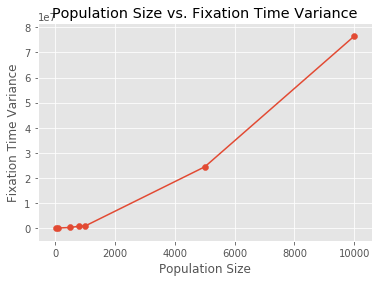


### a2) Comparison of fixation time variance vs. starting allele frequency
Next, we will retrieve the fixation time variance while varying allele frequency.


```python
%matplotlib inline

# Population sizes to test for
p_frequencies = np.linspace(0, 1, num=15, endpoint=True)
# Array to contain variances
p_variances = []
p_mean = []
for p_i in p_frequencies:
    print("Population " + str(pop))
    
    # Number of simulations
    s = 500

    # Fixation time simulations
    gen = []

    # For each simulation
    for s_i in range(s):

        # Start with n = 200
        n = 200

        # p is the fraction of target allele at geneartion 1
        p = p_i

        # A_Len is the target allele count at generation i + 1
        A_len = scipy.stats.binom.rvs(n, p)

        # i is the generation (starting at 1)
        i = 1

        # While there is not an extinction event (where target allele is everyone or none)
        while A_len != n and A_len != 0:
            # Set the new p
            p = A_len / n

            # Set the new A_len
            A_len = scipy.stats.binom.rvs(n, p)

            # Increment the generation
            i = i + 1

        # Record the generation to fixation
        gen.append(i)
    
    # Calculate the standard deviance and variance
    sd = np.std(gen)
    var = np.var(gen)
    mean = np.mean(gen)
    p_variances.append(var)
    p_mean.append(mean)
    print("Generations: " + str(gen))
    print("SD: " + str(sd))
    print("Variance: " + str(var))
    print("")
```

#### Visualization of starting allele frequency vs. fixation time variance
We will plot the starting allele frequency on the X axis and the fixation time variance on the Y axis.

__Answer to 2a2__: We see that the fixation time variance is at its max at p = 0.5 and the variance is 0 at 0.0 and 1.0. The same pattern will exist for the fixation time mean as well. The fixation time mean is at its max at p=0.5 since the entropy is at its highest, therefore it will take more generations for entropy to equal 0 (fixation). Similar to 2a1, the fixation time variance is the same pattern likely since the fixation time variance increases as the fixation time mean increases as well.


```python
plt.title("Starting Allele Frequency vs. Fixation Time Variance")
plt.xlabel("Starting Allele Frequency")
plt.ylabel("Fixation Time Variance")
plt.plot(p_frequencies, p_variances)
plt.scatter(p_frequencies, p_variances)
plt.show()

plt.title("Starting Allele Frequency vs. Fixation Time Mean")
plt.xlabel("Starting Allele Frequency")
plt.ylabel("Fixation Time Mean")
plt.plot(p_frequencies, p_mean)
plt.scatter(p_frequencies, p_mean)
plt.show()
```


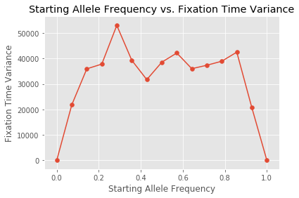


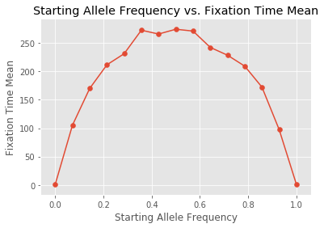


### b.1) Population Size vs. Starting Allele Frequency vs. Expected Extinction Frequency 

We are interested in seing the expected extinction frequency in relationship to the population size and starting allele frequency.

Below is the simulation for extinction frequency that takes the starting allele frequency and population size as inputs:


```python
%matplotlib inline

def extinction_frequency(starting_p, population_size, simulations):
    # This array will hold the fixation type for each simulation (True if extinction, false if fixation)
    fixation_type = []
    
    # This array will hold the extinction time
    extinction_times = []
    
    # For each simulation
    for s_i in range(simulations):
        
        # n represents the population size
        n = population_size

        # p is the fraction of target allele at generation 0
        p = starting_p

        # A_Len is the target allele count at the first generation
        A_len = scipy.stats.binom.rvs(n, p)

        # i is the generation (starting at 1)
        i = 1

        # While there is not an extinction or fixation
        while A_len != n and A_len != 0:
            # Set the new p
            p = A_len / n

            # Set the new A_len
            A_len = scipy.stats.binom.rvs(n, p)

            # Increment the generation
            i = i + 1

        # Record the type of event (True if extinction, False if fixation)
        fixation_type.append(A_len == 0)

        # If there is an extinction, record the extinction time
        if A_len == 0:
            extinction_times.append(i)

    # Binarize the fixation type array to perform statistics on it
    fixation_type_binarized = [1 if event else 0 for event in fixation_type]

    # The mean extinction frequency
    extinction_freq = np.mean(fixation_type_binarized)
    
    # The SEM for extinction frequency
    extinction_freq_sem = stats.sem(fixation_type_binarized)
    
    # The mean extinction time
    extinction_time = np.mean(extinction_times)
    
    # The SEM for extinction time
    extinction_time_sem = stats.sem(extinction_times)

    


    print("Fixation Types: " + str(fixation_type_binarized))
    print("Extinction Frequency: " + str(extinction_freq))
    print("SEM: " + str(extinction_freq_sem))
    print("Extinction Time: " + str(extinction_time))
    print("SEM: " + str(extinction_time_sem))
    print("")
    
    return (extinction_freq, extinction_freq_sem, extinction_time, extinction_time_sem)

#print(p_expected_extinction_i)
#print(p_expected_extinction_i_sem)
#plt.title("Starting Allele Frequency vs. Expected Extinction Frequency")
#plt.xlabel("Starting Allele Frequency")
#plt.ylabel("Expected Extinction Frequency (100 simulations, 200 population)")
#plt.plot(p_frequencies, p_expected_extinction_freq)
#plt.errorbar(p_frequencies, p_expected_extinction_freq, p_expected_extinction_freq_sem, linestyle='None', marker='^')
#plt.show()

#plt.title("Starting Allele Frequency vs. Expected Extinction Time")
#plt.xlabel("Starting Allele Frequency")
#plt.ylabel("Expected Extinction Time (100 simulations, 200 population)")
#plt.plot(p_frequencies[0:len(p_expected_extinction_i)], p_expected_extinction_i)
#plt.errorbar(p_frequencies[0:len(p_expected_extinction_i)], p_expected_extinction_i, p_expected_extinction_i_sem, linestyle='None', marker='^')
#plt.show()
```

We will now run the simulation for several combinations of starting allelef frequencies and population sizes


```python
p_frequencies = np.linspace(0, 1, num=15, endpoint=True)
pop_sizes = [10, 100, 500, 800, 1000, 3500, 5000, 7500, 10000]
p_population_dynamics = [extinction_frequency(p, pop, 100) for pop in pop_sizes for p in p_frequencies]
```

#### Visualization of extinction frequency based on change in population size and starting allele frequency
__Answer for 2b__: We see that as the starting allele frequency increases, the extinction frequency decreases likely since it is more difficult for extinction to occur for a high allele frequency. We see no change in extinction frequency when increasing population size. There does not seem to be an interaction effect between population size and starting allele frequency.


```python
inputs = [(pop, p) for pop in pop_sizes for p in p_frequencies]

%matplotlib inline
from mpl_toolkits.mplot3d import Axes3D

fig = plt.figure()
ax = Axes3D(fig)
x = [input[0] for input in inputs] # Population Size
y = [input[1] for input in inputs] # Starting Allele Frequency
z = [result[0] for result in p_population_dynamics] # Extinction Frequency

# Plot the surface.
surf = ax.scatter(x, y, z, c=z,
                       linewidth=.01, s=5, antialiased=False)
ax.view_init(elev=30., azim=20)
ax.set_title("Population Size vs. Starting Allele Frequency vs. Extinction Frequency")
ax.set_xlabel("Population Size")
ax.set_ylabel("Starting Allele Frequency")
ax.set_zlabel("Extinction Frequency")


```


    Text(0.5,0,'Extinction Frequency')


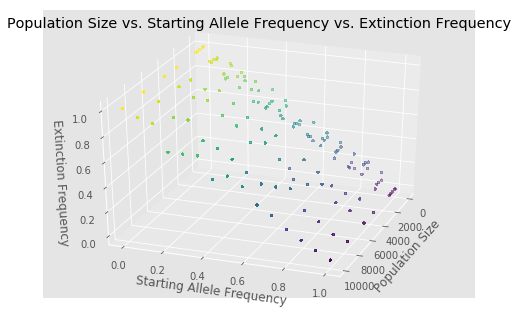


# Question 3: Nontrivial equilibria in a diploid population

## a) Overdominant selection

We will plug in the appropriate values of $W_{AA}$, $W_{Aa}$, and $W_{aa}$ into the given formulas to solve $\tilde{p}$. Below is most of the algebra:

\begin{align}
    \textrm{ Let } W_{AA} = 0, W_{Aa}=1+s, W_{aa}=1 \\
    \bar{W} = 2p(1-p)(1+s)+(1-p)^2 \textrm{ based on formula}\\
    \Delta{p} = p(1-p) \frac{1+s}{2p(1-p)(1+s) + (1-p)^2} - p\textrm{ also based on formula }\\
    \Delta{p} = \frac{p(1+s)}{1+p+2ps} - \frac{p + p^2 + 2sp^2}{1+p+2ps} \textrm{ after simplification and using LCD } \\
    \Delta{p} = \frac{sp-p^2-2sp^2}{1+p+2ps} \textrm{ after simplifying }
\end{align}

\begin{align}
    \Delta{p} = 0 \textrm{ during equilibrium, therefore...} \\
    \frac{sp-p^2-2sp^2}{1+p+2ps} = 0 \textrm{ during equilibrium } \\
    sp-p^2-2sp^2 = 0 \textrm{ multiple both sides by denominator } \\
    -p^2(2s+1) + sp = 0 \textrm{ factor terms } \\
    -p^2(2s+1) = -sp \textrm{ move sp over } \\
    p(2s+1) = s \textrm{ multiply by -1/p } \\
    p = \frac{s}{2s+1} \textrm{ divide by 2s + 1} \\
\end{align}

Therefore $\tilde{p} = \frac{s}{2s+1}$

## b) Underdominant selection

We will plug in the appropriate values of $W_{AA}$, $W_{Aa}$, and $W_{aa}$ into the given formulas to solve $\tilde{p}$. Below is most of the algebra (many of the simple algebra operations will be skipped for clarity):

\begin{align}
    \textrm{ Let } W_{AA} = 1+s, W_{Aa}=1-s^2, W_{aa}=1 \\
    \bar{W} = p^2(1+s) + 2p(1-p)(1+s^2)+(1-p)^2 \textrm{ based on formula}\\
    \Delta{p} = \frac{p^2(1+s)}{p^2(1+s) + 2p(1-p)(1+s^2)+(1-p)^2} + \frac{p(1-p)(1-s^2)}{p^2(1+s) + 2p(1-p)(1+s^2)+(1-p)^2} - p \textrm{ also based on formula }\\
    \Delta{p} = \frac{p^2(1+s) + p(1-p)(1-s^2)}{p^2(1+s) + 2p(1-p)(1+s^2)+(1-p)^2} - p \textrm{ combine fractions with same denominators}\\
    \Delta{p} = \frac{sp^2 + p - ps^2 + s^2p^2}{sp^2-2ps^2+2p^2s^2 + 1} - p \textrm{ distribute out and simplify}\\
    \Delta{p} = \frac{sp^2 + p - ps^2 + s^2p^2}{sp^2-2ps^2+2p^2s^2 + 1} + \frac{-p(sp^2-2ps^2+2p^2s^2 + 1)}{sp^2-2ps^2+2p^2s^2 + 1} \textrm{ use LCD }\\
    \Delta{p} = \frac{-sp^3 + 3p^2s^2 - 2p^3s^2 + sp^2 - ps^2}{sp^2-2ps^2+2p^2s^2 + 1}  \textrm{ combine terms and simplify}\\
\end{align}

\begin{align}
    \Delta{p} = 0 \textrm{ during equilibrium, therefore...} \\
     \frac{-sp^3 + 3p^2s^2 - 2p^3s^2 + sp^2 - ps^2}{sp^2-2ps^2+2p^2s^2 + 1} = 0 \textrm{ during equilibrium}\\
     -sp^3 + 3p^2s^2 - 2p^3s^2 + sp^2 - ps^2 = 0 \textrm{ multiple both sides by the denominator } \\
     p^3(-s-2s^2) + p^2(3s^2+s) - ps^2 = 0 \textrm{ reorder and factor out terms}\\
     p^3(-s-2s^2) + p^2(3s^2+s) = ps^2 \textrm{ add both sides by ps^2}\\
     p^2(-s-2s^2) + p(3s^2+s) = s^2 \textrm{ divide both sides by p}\\
     sp^2(-2s - 1) + ps(3s+1) = s^2 \textrm{ factor out s}\\
     p^2(-2 - 1) + p(3s+1) = s \textrm{ divide both sides by s}\\
     p^2 + \frac{p(3s+1)}{-2s-1} = \frac{s}{-2s-1} \textrm{ first step in completing the square}\\
     p^2 + \frac{p(3s+1)}{-2s-1} + \frac{(3s+1)^2}{4(-2s-1)^2} = \frac{s}{-2s-1} + \frac{(3s+1)^2}{4(-2s-1)^2} \textrm{ second step in completing the square}\\
     (p + \frac{3s+1}{-2s-1})^2 = \frac{s}{-2s-1} + \frac{(3s+1)^2}{4(-2s-1)^2} \textrm{ third step in completing the square}\\
     (p + \frac{3s+1}{-2s-1})^2 = \frac{(s+1)^2}{4(2s+1)^2} \textrm{ simplify the RHS }\\
     p = \pm \frac{(s+1)}{2(2s+1)} - \frac{3s+1}{-2s-1})^2 \textrm{ isolate p, plus-minus comes  from square root }\\
     p = \frac{\pm s \pm 1 + 3s + 1 + 1}{4s + 2} \textrm{ get LCD and combine terms }\\
     p = 1 \textrm{ OR } p = \frac{s}{2s+1}\\
\end{align}

Therefore $\tilde{p} = \frac{s}{2s+1}$

### c) Long-term behavior of p for overdominance and underdominance

We will create a simulation to see how $\Delta{p}$ changes over time when the starting allele frequency is $\tilde{p}$ and a small error $\epsilon$ is introduced.

Below is the simulation function that notably takes in the fitnesses of all genotypes as an input:


```python
%matplotlib inline

def selection_scenarios(W_AA, W_Aa, W_aa, population_size, p_start, simulations, error=0.1):
    # Array for containing the p trajectories for all simulations
    p_trajectories = []
    for s_i in range(simulations):
        
        # n represents the population size
        n = population_size

        # Array that stores the value of p 
        p_per_generation = []
        
        # p is the fraction of target allele at generation 0
        p = p_start
        
        W_bar = ((p**2)*W_AA) + (2*p*(1-p)*W_Aa) + ((1-(p**2))*W_aa)
        p_delta = ((p**2)*(W_AA/W_bar)) + (p*(1-p)*(W_Aa/W_bar))
        p_per_generation.append((error, 0, p_delta))
        # A_Len is the target allele count at the first generation
        A_len = scipy.stats.binom.rvs(n, p)

        # i is the generation (starting at 1)
        i = 1
        
        
        
        # While there is not an extinction or fixation or generation is not over 100
        while A_len != n and A_len != 0 and i < 500:
            # Set the new p
            p = A_len / n
            
            #print("P before: " + str(p))
            
            # Set W_bar
            W_bar = ((p**2)*W_AA) + (2*p*(1-p)*W_Aa) + ((1-(p**2))*W_aa)
            
            # Apply selectivity
            p_delta = ((p**2)*(W_AA/W_bar)) + (p*(1-p)*(W_Aa/W_bar))
            p = p + p_delta
            
            #print("P after selection: " + str(p))
            
            # Add noise to p
            p = p + stats.norm.rvs(loc=0, scale=error)
            
            # Bring back to range
            p = 1 if p > 1 else p
            p = 0 if p < 0 else p
            
            #print("P after: " + str(p))
            # Store p
            p_per_generation.append((error, i, p))
            
            # Set the new A_len
            A_len = scipy.stats.binom.rvs(n, p)

            # Increment the generation
            i = i + 1
        
        p_trajectories.append(p_per_generation)
    
    return p_trajectories
```

### Visualization of overdominance case
The x axis is the error rate applied, the y axis is the generation number over time, and the z axis is p

__First answer for 3c: overdominance__, we see that for any error, p converges to $\tilde{p}$


```python
s = 0.1
W_AA = 0
W_Aa = 1 + s
W_aa = 1
p_eq = s / (2*s + 1)
errors = np.linspace(0, .1, num=100, endpoint=True)
overdominance_noise = [selection_scenarios(W_AA, W_Aa, W_aa, 1000, p_eq, 10, error=error) for error in errors]


overdominance_noise = [generation for simulation in overdominance_noise for trajectory in simulation for generation in trajectory] # Non-numpy way to flatten

%matplotlib inline
from mpl_toolkits.mplot3d import Axes3D

fig = plt.figure()
ax = Axes3D(fig)
x = [generation[0] for generation in overdominance_noise] # Error
y = [generation[1] for generation in overdominance_noise] # Generation number
z = [generation[2] for generation in overdominance_noise] # P

# Plot the surface.
surf = ax.scatter(x, y, z, c=z,
                       linewidth=.01, s=5, antialiased=False)
ax.view_init(elev=30., azim=300)
ax.set_title("Population Size vs. Mutation Rate vs. Fixation Frequency")
ax.set_xlabel("Error Rate")
ax.set_ylabel("Gernation Number")
ax.set_zlabel("P")


#s = 0.1
#W_AA = 1+s
#W_Aa = 1-(s**2)
#W_aa = 1
#underdominance_noise = [selection_scenarios(W_AA, W_Aa, W_aa, 300, 0.1, 100, error=error) for error in errors]
```


    Text(0.5,0,'P')


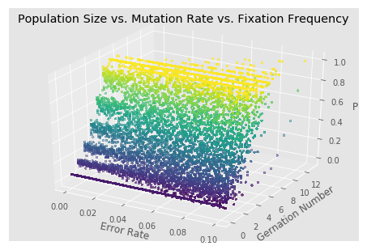


### Visualization of underdominance case
The x axis is the error rate applied, the y axis is the generation number over time, and the z axis is p

__First answer for 3c: underdominance__, we see that for any error, p converges to 1. What is interesting is that 1 is another solution for $\tilde{p}$ from the algebraic solution in 3b.


```python
s = 0.1
W_AA = 1+s
W_Aa = 1-(s**2)
W_aa = 1
p_eq = s / (2*s + 1)
print("P_eq= ", str(p_eq))
errors = np.linspace(0, .1, num=100, endpoint=True)
underdominance_noise = [selection_scenarios(W_AA, W_Aa, W_aa, 1000, p_eq, 10, error=error) for error in errors]
underdominance_noise = [generation for simulation in underdominance_noise for trajectory in simulation for generation in trajectory] # Non-numpy way to flatten

%matplotlib inline
from mpl_toolkits.mplot3d import Axes3D

fig = plt.figure()
ax = Axes3D(fig)
x = [generation[0] for generation in underdominance_noise] # Error
y = [generation[1] for generation in underdominance_noise] # Generation number
z = [generation[2] for generation in underdominance_noise] # P

# Plot the surface.
surf = ax.scatter(x, y, z, c=z,
                       linewidth=.01, s=5, antialiased=False)
ax.view_init(elev=30., azim=300)
ax.set_title("Population Size vs. Mutation Rate vs. Fixation Frequency")
ax.set_xlabel("Error Rate")
ax.set_ylabel("Gernation Number")
ax.set_zlabel("P")
```

    P_eq=  0.08333333333333334
    


    Text(0.5,0,'P')


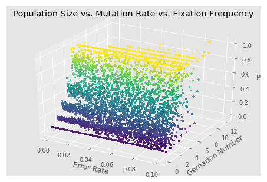


# Question 4: Equilibrium in a haploid population with mutation and selection

Below is the simulation encorporating mutation and selection in a haploid population. See the output of the simulation run for plots, then read the answers below.

__Answer 4a__

When running `mutation_and_selection(mutation_rate=0.001, selection=0.01, population=100, simulations=10`, we see that that fixation occurs slightly more often than exinction due to the relative increase in fitness. Therefore, p will either be 1 or 0.

__Answer 4b1__

When running `mutation_and_selection(mutation_rate=0.001, selection=0.01, population=1000, simulations=10`, we see that that fixation occurs much more often than exinction due to the relative increase in fitness and the higher population. This is likely since a population is more finite with p=100, the likelihood of extinction is higher than in a larger population (of p=1000 or higher). Therefore, p will always reach either 1 or 0. 

__Answer 4b2__

In the plot comparing population size vs. allele frequency, we see that as population size increases, allele frequency also increases to 1 likely due to the same explanation in answer 4b1. 

In the plot comparing mutation rate vs. allele frequency, we see that as mutation rate increases, allele frequency decreases to 0, perhaps due to the stronger likelihood that the allele with higher selectivity will also be more likely to be mutated when the mutation rate is high.

In the plot comparing selection vs. allele frequency, we see that equilibrium allele frequency is 0 when selection is negative, and equilibrium allele frequency is 1 when selection is positive, and equilibrium allele frequency is 0.5 when selection is neutral. Therefore, this shows that fixation occurs on the allele that is selected for.


```python
%matplotlib inline

#
#
#
def mutation_and_selection(mutation_rate, selection, population, simulations):
    # Number of simulations
    W_A = 1+selection # Fitness of A
    W_a = 1 # Fitness of a
    
    # Fixation time simulations
    simulation_result = []
    # For each simulation
    for s_i in range(simulations):
        
        # This array will store information about each generation
        generation_i_context = []
        
        # Start with n = 200 
        n = population

        # p is the fraction of target allele at geneartion 1
        p = 0.5

        # A_Len is the target allele count at generation i + 1
        A_len = scipy.stats.binom.rvs(n, p)

        
        # i is the generation (starting at 1)
        i = 1

        # While there is not an extinction event (where target allele is everyone or none)
        while A_len != n and A_len != 0 and i < 1000:
            p = A_len / n
            # Set the new frequency as the following: current frequency of 'A' times its fitness + the mutation rate * 'a' substracted by the mutation_rate * 'A'
            p_new = (p*W_A)/ (p*W_A + (1-p))
            p_new = 1 if p_new > 1 else p_new
            p_new = 0 if p_new < 0 else p_new
            
            # Set the new A_len with p increasing based on fitness
            A_len = scipy.stats.binom.rvs(n, p_new)
            
            #Apply mutation
            A_len = A_len + scipy.stats.binom.rvs(n-A_len,mutation_rate) - scipy.stats.binom.rvs(n, mutation_rate)
            
            # Equilibrium determination (The new p is equal to the old)
            #if p_new == p:
            #    break
            #else:
            #    p=p_new
            # Increment the generation
            p = p_new
            i = i + 1
            
        
        # Record all generations and the generation to fixation
        #simulation_result.append((generation_i_context, (generation_i_context[len(generation_i_context) - 1]))) # Let's store a tuple for each generation with relevant context: generation count, p, and A
        simulation_result.append((i, p, A_len))
    return (mutation_rate, selection, population, simulations, simulation_result)
    
def print_simulation_result(simulation_result):
        equilibrium_i = np.mean([result[0] for result in simulation_result])
        equilibrium_p = np.mean([result[1] for result in simulation_result])
        equilibrium_A_len = np.mean([result[2] for result in simulation_result])
        print("Value of p at fixation for each simulation: " + str([result[1] for result in simulation_result]))
        print("Equilibrium occured at generation " + str(equilibrium_i) + " with p at " + str(equilibrium_p))
        
print("4a1 results with population 100")
print_simulation_result(mutation_and_selection(mutation_rate=0.001, selection=0.01, population=100, simulations=10)[4])
              
print("4a2 results with population 100")
print_simulation_result(mutation_and_selection(mutation_rate=0.001, selection=0.01, population=10000, simulations=10)[4])

# Question of interest: How does equilibrium change with population
population_samples = list(range(100, 1000, 100))
population_results = [mutation_and_selection(mutation_rate=0.001, selection=0.01, population=population, simulations=10)[4] for population in population_samples]
population_mean_frequency = [np.mean([result[1] for result in simulation_result]) for simulation_result in population_results]
plt.title("Population Size vs. Equilibrium Allele Frequency")
plt.xlabel("Population Size")
plt.ylabel("Equilibrium Allele Frequency")
plt.plot(population_samples, population_mean_frequency)
plt.show()

# Question: How does equilibrum change with mutation?
#mutation_results = [(population, mutation_and_selection(mutation_rate=mutation_rate, selection=0.01, population=100, simulations=1)) for mutation_rate in np.linspace(0, 1, num=15, endpoint=FALSE)]
#[result[0], result[1][len(result) - 1][2] for result in mutation_results]

mutation_rate_samples = np.linspace(0, 0.1, num=15, endpoint=False)
mutation_rate_results = [mutation_and_selection(mutation_rate=mutation_rate, selection=0.01, population=500, simulations=10)[4] for mutation_rate in mutation_rate_samples]
mutation_rate_mean_frequency = [np.mean([result[1] for result in simulation_result]) for simulation_result in mutation_rate_results]
plt.title("Mutation Rate vs. Equilibrium Allele Frequency")
plt.xlabel("Mutation Rate")
plt.ylabel("Equilibrium Allele Frequency")
plt.plot(mutation_rate_samples, mutation_rate_mean_frequency)
plt.show()

# Question: How does the equilibrium change with selection?
selection_samples = np.linspace(-0.3, 0.3, num=15, endpoint=False)
selection_results = [mutation_and_selection(mutation_rate=0.001, selection=selection, population=500, simulations=10)[4] for selection in selection_samples]
selection_mean_frequency = [np.mean([result[1] for result in simulation_result]) for simulation_result in selection_results]
plt.title("Selection vs. Equilibrium Allele Frequency")
plt.xlabel("Selection")
plt.ylabel("Equilibrium Allele Frequency")
plt.plot(selection_samples, selection_mean_frequency)
plt.show()

```

    4a1 results with population 100
    Value of p at fixation for each simulation: [0.0100989901009899, 0.0100989901009899, 0.9900980295078721, 0.02019596080783843, 0.9900980295078721, 0.9801940978411566, 0.9801940978411566, 0.0100989901009899, 0.05047476261869066, 0.9900980295078721]
    Equilibrium occured at generation 121.5 with p at 0.503164997794
    4a2 results with population 100
    Value of p at fixation for each simulation: [0.8626829860749642, 0.9050584613920927, 0.8855126406930698, 0.897221206327685, 0.9077367355453394, 0.84838433628731, 0.8793595847669915, 0.8552362821504352, 0.9128944893625245, 0.9195392731582221]
    Equilibrium occured at generation 1000.0 with p at 0.887362599576
    


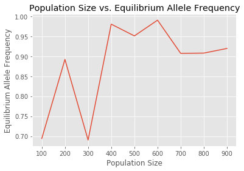


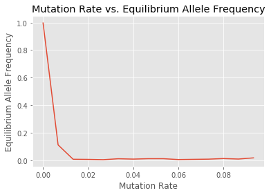


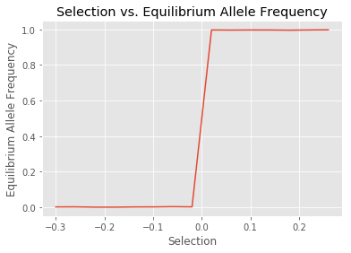


# Q5: Emergency and fixation of a rare allele

## a)
### a1)
We first need to determine what the probability of getting no A*, which is determined by the binomial distribution where x = 0 or by equivallentaly multiplying bernoulli trials:
\begin{align}
     P(X=0) = Binomial(N, \mu, 0) = (1-\mu)^n \\
     P(X=0) = \prod_{i=1}^{n} Bernoulli(1-\mu) = (1-\mu)^n \\
\end{align}

Additionally, we will need the complement. Specifically, the probability that we will get at least 1 A*

\begin{align}
     P(X>0) = 1 - P(X=0) = 1 - (1-\mu)^n
\end{align}

With these probabilities, we can plug them into a geometric distribution representing how many failures it will take to get our first success (appearance of A*). The geometric pdf can be interpreted as getting failures P(X=0) (no A*) k-1 times, then on the kth time, we get a success P(X>0) (1 or more A*)/

\begin{align}
     G \sim Geometric(1-(1-\mu)^n, k) = ((1-\mu)^n)^{k-1}(1-(1-\mu)) \\
\end{align}

### a2)
The probability distribution of the frequency of allele A* when it first appears must no probability for sampling 0, therefore standard distributions may not work. In this case, we can use the zero-truncated Poisson model (Poisson model conditioned on x not being 0) to model this behavior.

\begin{align}
     P \sim ZTP(\lambda = n\mu) \\
\end{align}

## b) 
### b1)

The expected number of generations for allele A* to appear will simply be the expected value of the geometric distribution stated in 5a1. Recall that the expected value of a geometric distribution is the following: 

\begin{align}
    E[S] =\frac{1}{p} \textrm{ given }\ S \sim Geometric(p)
\end{align}

therefore 
\begin{align}
    E[G] = \frac{1}{1-(1-\mu)^n}
\end{align}

thereby dependening on both $\mu$ and $n$ (mutation rate and population size, resp.)

### b2)

The average frequency of allele A* when it first appears must also use the zero-truncated Poisson model since it guarantees that one allele must exist. We also take the expected value of the ZTP distribution stated in 5a1. The expected value of ZTP is:

\begin{align}
    E[S] = \frac{\lambda}{1-e^{-\lambda}} \textrm{ given }\ S \sim ZTP(\lambda)
\end{align}

therefore

\begin{align}
    E[P] = \frac{n\mu}{1-e^{-n\mu}}  \textrm{ since } \lambda = n\mu
\end{align}

thereby dependening on both $\mu$ and $n$ (mutation rate and population size, resp.)
    

### b3)
To determine what the probability that A`*` fixes after the first time it appears in the population, we will perform a simulation without using expectation (and instead random sampling):

#### Simulation function that takes several different inputs
- We will use the Poisson distribution to sample A->A`*` mutations at the start iteratively (we could use ZTP instead).
- Once we see at least one A->A`*` mutation in the population, we will simulate each generation by applying selection to p (which would be 0), binomial sampling for the new amount of A`*` in the population, then applying mutations using binomial sampling on the A population (not using Poisson since the size of the A population may be small).


```python
%matplotlib inline

def fixation_of_rare_allele(mutation_rate, selection, population, simulations):
    # Fitness of A*
    W_A = 1+selection
    
    # Fitness of A
    W_a = 1
    
    # Records whether a fixation or extinction occured
    fixation_occurence = []
    fixation_time = []
    # For several simulations
    for s_i in range(simulations):
        
        # Set n to be the population size
        n = population

        # p represents the starting allele frequency, which is 0 at first since no A* exist yet
        p = 0

        # A_Len is the number of A*, which is 0 since p is 0
        A_len = 0
        
        # Keep iterating until we have a generation where 1 or more A are produced. An alternative solution is to use the ZTP, though our solution should possess lesser approximations than using ZTP
        j = 1
        while A_len == 0:
            # We will use poisson (since n is large and mu is small) to determine the A* frequency after mutation
            A_len = scipy.stats.poisson.rvs(n * mutation_rate)
            j = j +1
        i = 1
        
        # While there is no extinction or fixation
        while A_len != n and A_len != 0:
            # Set p
            p = A_len / n
            
            # First, we apply selection on p
            p = (p*W_A)
            
            # Ceil to 1
            p = 1 if p > 1 else p
            
            # We will use binomial sampling to get the new A* frequency based on selection
            A_len = scipy.stats.binom.rvs(n, p)

            
            # We will then see when A indivuals mutated into A* from mu using the binomial distribution, and add that to A_len
            A_len = A_len + scipy.stats.binom.rvs(n-A_len, mutation_rate)
            
            i = i + 1
            
        # Let us record the type of event that occured, TRUE is fixation and FALSE is extinction
        fixation_occurence.append(A_len == n) 
        fixation_time.append(i)
    # Binarize the fixation occurence to perform statistics
    fixation_occurence_binarized = [1 if event else 0 for event in fixation_occurence]
    
    # Get the frequency by taking the mean of the binarized array
    fixation_freq = np.mean(fixation_occurence_binarized)
    fixation_time_mean = np.mean(fixation_time)
    fixation_time_sem = stats.sem(fixation_time)
    # Get the SEM
    fixation_freq_sem = stats.sem(fixation_occurence_binarized)
    
    print("Mutation Rate: " + str(mutation_rate))
    print("Fixation Types: " + str(fixation_occurence))
    print("Fixation Frequency: " + str(fixation_freq))
    print("SEM: " + str(fixation_freq_sem))
    print("")

    return (fixation_freq, fixation_freq_sem, fixation_time_mean, fixation_time_sem)
```

#### Set the different values of mutation_rate and population_samples
We will vary mutation rate from 0.001 to 0.01 and population size from 50 to 550. The range of these is restricted since we see the most change in fixation frequency in this range, additionally I have limited computational resources to run a larger range.


```python
mutation_rate_samples = np.linspace(0.001, 0.01, num=20, endpoint=False)
population_samples = list(range(50, 550, 50))
```

#### Run the simulation with the values of mutation_rate and population_sizes
Run the simulation for every pairwise combination of mutation_rate and population_sizes


```python
population_mutation_dynamics = [(population, mutation_rate, fixation_of_rare_allele(mutation_rate=mutation_rate, selection=0, 
                                                                                    population=population, simulations=100)) for population in population_samples for mutation_rate in mutation_rate_samples]
```

#### Visualize a 3D plot showing how fixation_frequency changes with mutation_rate and population_size

Now, we visualize the results on the 3D plot. The 3D plot was oriented to best visualize the surface, therefore be aware of the directionality of the axis.

__ANSWER TO 5b3 and 5b4__: We see an increase in fixation frequency (___probability the A`*` fixes___) as the population size increases and as the mutation_rate increases. As an interpretation, the increase in fixation frequency as the population size increases is likely due to the higher likelihood of generating A->A`*` mutants from the binomial sampling. Similarily, the increase in fixation frequency as the mutation_rate increases is likely due to the higher likelihood of generating A->A`*` mutants. This makes sense because mutations are the only force acting in favor of A`*`.


```python
%matplotlib inline
from mpl_toolkits.mplot3d import Axes3D

fig = plt.figure()
ax = Axes3D(fig)
x = np.asarray([result[0] for result in population_mutation_dynamics])
y = np.asarray([result[1] for result in population_mutation_dynamics])
z = np.asarray([result[2][0] for result in population_mutation_dynamics])
X, Y= np.meshgrid([result[0] for result in population_mutation_dynamics], [result[1] for result in population_mutation_dynamics])
Z= np.tile(np.transpose([result[2][1] for result in population_mutation_dynamics]), (len(population_mutation_dynamics),1))

# Plot the surface.
surf = ax.scatter(x, y, z, c=z,
                       linewidth=1, antialiased=False)
ax.view_init(elev=40., azim=130)
ax.set_title("Population Size vs. Mutation Rate vs. Fixation Frequency")
ax.set_xlabel("Population Size")
ax.set_ylabel("Mutation Rate")
ax.set_zlabel("Fixation Frequency")

```


    Text(0.5,0,'Fixation Frequency')


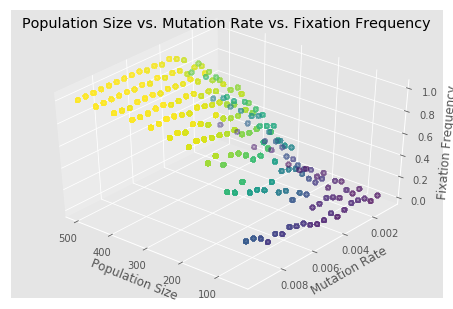


#### b5) What is the expected time for a new allele to emerge and fix in the population? (OPTIONAL: Do a simulation)

We already know the time for a new allele to energe from 5b1: 

\begin{align}
    E[G] = \frac{1}{1-(1-\mu)^n}
\end{align}

Therefore, the only term we need to know is after emergence, how long does it take for fixation

When sampling for the the amount of `A*` in the next generation based on the current allele frequency _p_, we use binomial sampling: `A_new ~ Binomial(N, A_old/N)`. By expectation, `E[A_new] = A_old`, therefore since the expected amount of `A*` in the next generation is the same as the old generation, we can neglect this binomial sampling when calculating expected fixation time since it is expected that no change in `A*` population will occur without selectivity. The force that increases `A*` towards fixation is mutation rate, which for each A allele is sampled by a Bernoulli trial with probability $\mu$:

\begin{align}
    B \sim Bernoulli(p=\mu) \\
    E[B] = \mu
\end{align}

For fixation to occur, we assume that all individuals must mutate from A->A`*` at an expected probability of $\mu$. As all trials run independently and simultaneously, the expected time for all A to mutate to A`*` follows the distribution with its associated expected value:

\begin{align}
    K \sim Geometric(p=E[b]) \\
    E[K] = \frac{1}{E[b]} = \frac{1}{\mu} 
\end{align}

Therefore the expected time to fixation is:
\begin{align}
    E[G] + E[K] = \frac{1}{1-(1-\mu)^n} + \frac{1}{\mu} 
\end{align}


### c) How long does it take for A`*` to appear and fix (take over) the population on average given that s > 0?

We will use the same simulation as 5b, except varying for selection with population and varying selection with mutation_rate


```python
selection_samples = np.linspace(0, 0.5, num=5, endpoint=False)
selection_mutation_dynamics = [(selection, fixation_of_rare_allele(mutation_rate=0.01, selection=selection, population=300, simulations=100)) for selection in selection_samples]
```

### Visualization of fixation time when changing selection

We will be visualization the fixation time when change selection

__Answer for 5c1__ 
We see that the fixation time decreases when selection for an allele increases. This is due to $\Delta p$ being larger when _s_ is larger, thereby speeding up the time to fixation (also known when looking at the relationship between expected fixation time and selection).


```python
%matplotlib inline

plt.title("Selection vs. Fixation Time Mean")
plt.xlabel("Selection")
plt.ylabel("Fixation Time Mean")
plt.plot([result[0] for result in selection_mutation_dynamics], [result[1][2] for result in selection_mutation_dynamics])
plt.scatter([result[0] for result in selection_mutation_dynamics], [result[1][2] for result in selection_mutation_dynamics])
plt.show()

```


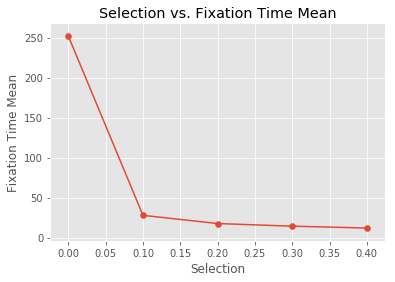


### Visualization of fixation time when changing selection and population size


```python
population_samples = list(range(500, 1000, 100))
selection_samples = np.linspace(0, 0.5, num=10, endpoint=False)
selection_population_dynamics = [(selection, population, fixation_of_rare_allele(mutation_rate=0.005, selection=selection, 
                                                                                    population=population, simulations=100)) for selection in selection_samples for population in population_samples]
```


```python
%matplotlib inline
from mpl_toolkits.mplot3d import Axes3D

fig = plt.figure()
ax = Axes3D(fig)
x = np.asarray([result[0] for result in selection_population_dynamics])
y = np.asarray([result[1] for result in selection_population_dynamics])
z = np.asarray([result[2][2] for result in selection_population_dynamics])

# Plot the surface.
surf = ax.scatter(x, y, z, c=z,
                       linewidth=1, antialiased=False)
ax.view_init(elev=40., azim=130)
ax.set_title("Selection vs. Population Size vs. Fixation Time")
ax.set_xlabel("Selectivity")
ax.set_ylabel("Population Size")
ax.set_zlabel("Fixation Time")

```


    Text(0.5,0,'Fixation Time')


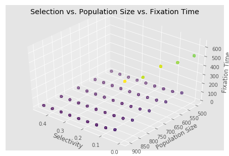


```python

```


```python

```
